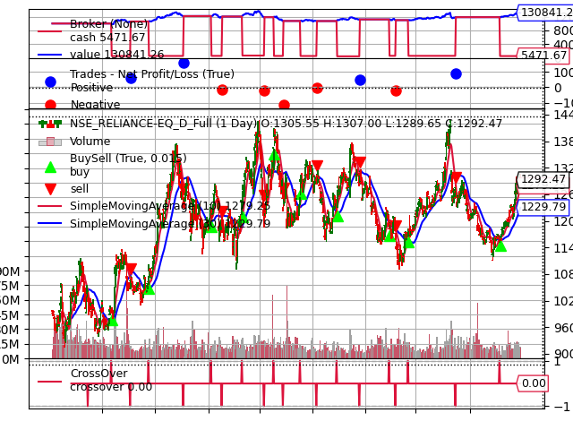

# ML-enabled Trading Bot 📈🤖

[](https://github.com/ShivanandhGangapuram/ML_enabled_Trading_Bot/stargazers)
[](https://github.com/ShivanandhGangapuram/ML_enabled_Trading_Bot/network/members)
[](https://github.com/ShivanandhGangapuram/ML_enabled_Trading_Bot/issues)
[](https://github.com/ShivanandhGangapuram/ML_enabled_Trading_Bot/blob/main/LICENSE)
[](https://www.python.org/downloads/)

This project implements a sophisticated trading bot that leverages machine learning to identify patterns in stock price data and make intelligent trading decisions. The system combines the power of AI with traditional technical analysis, offering both approaches for comparison and optimal strategy selection.



## Key Features

- 🧠 **Machine Learning Strategy**: Uses Random Forest to predict price movements
- 📊 **Technical Analysis**: Implements traditional strategies like SMA crossover
- 🔄 **Strategy Comparison**: Compare ML vs traditional approaches
- 📈 **Backtesting Engine**: Robust system to evaluate strategy performance
- 🌐 **Multiple Data Sources**: Yahoo Finance and Fyers API support
- 🖥️ **User-friendly GUI**: Intuitive interface for all skill levels
- 📱 **Performance Optimized**: Designed for standard hardware (i5, 8GB RAM)

## System Requirements

- Python 3.6+
- 8GB RAM (minimum)
- i5 Processor or equivalent

## Installation

1. Install the required Python packages:

```bash
pip install backtrader pandas numpy scikit-learn matplotlib pillow
```

2. If you want to download data from Yahoo Finance:

```bash
pip install yfinance
```

3. If you want to use Fyers API for data:

```bash
pip install fyers-apiv3
```

4. Set up your API credentials:

```bash
# Copy the template configuration file
cp config_template.py config.py

# Edit config.py with your actual API credentials
# DO NOT commit config.py to version control!
```

## Files Overview

- `download_data.py`: Downloads historical stock data from Yahoo Finance
- `get_fyers_data.py`: Downloads historical stock data from Fyers API
- `backtest.py`: Implements and backtests a simple moving average crossover strategy
- `ml_strategy.py`: Implements machine learning for pattern recognition in stock data
- `backtest_ml.py`: Backtests the machine learning-based trading strategy
- `compare_strategies.py`: Compares the performance of traditional and ML strategies
- `trading_bot_gui.py`: Graphical user interface for the trading bot
- `run_trading_bot.py`: Launcher script for the GUI application

## How to Use

### Option 1: Using the GUI (Recommended)

The easiest way to use the trading bot is through the graphical user interface:

```bash
python run_trading_bot.py
```

The GUI provides an intuitive interface with the following tabs:

1. **Data**: Download or load historical price data
2. **Train Model**: Configure and train the machine learning model
3. **Backtest**: Run backtests with different strategies
4. **Compare**: Compare the performance of different strategies
5. **Results**: View backtest results and performance charts

### Option 2: Using Command Line Scripts

If you prefer using command line scripts, you can follow these steps:

#### 1. Download Historical Data

You can use either Yahoo Finance or Fyers API to download historical data:

```bash
# Using Yahoo Finance
python download_data.py

# Using Fyers API (requires Fyers account)
python get_fyers_data.py
```

#### 2. Train the Machine Learning Model

The machine learning model will be trained automatically when you run the backtest, but you can also train it separately:

```bash
python ml_strategy.py
```

This will:
- Load the historical data
- Add technical indicators and features
- Train a Random Forest model to predict price movements
- Save the trained model to `ml_model.pkl`

#### 3. Run Backtests

To backtest the traditional SMA crossover strategy:

```bash
python backtest.py
```

To backtest the machine learning strategy:

```bash
python backtest_ml.py
```

#### 4. Compare Strategies

To compare the performance of both strategies:

```bash
python compare_strategies.py
```

This will:
- Run backtests for both strategies
- Generate performance metrics
- Create a visual comparison chart saved as `strategy_comparison.png`

## Machine Learning Approach

The machine learning component:

1. **Feature Engineering**: Creates 30+ technical indicators and features from price data
2. **Model**: Uses Random Forest Classifier optimized for i5 processor and 8GB RAM
3. **Prediction**: Forecasts whether the price will go up or down in the next period
4. **Trading Logic**: Buys when the model predicts a high probability of price increase
5. **Performance Analysis**: Compares ML strategy against traditional technical analysis

## GUI Features

The graphical user interface provides several features to make the trading bot more accessible:

- **User-friendly Interface**: Intuitive tabbed interface for different tasks
- **Data Visualization**: View and analyze historical price data
- **Model Configuration**: Easily adjust machine learning parameters
- **Interactive Backtesting**: Run and compare different trading strategies
- **Results Visualization**: View performance charts and metrics
- **System Optimization**: Parameters optimized for i5 processor and 8GB RAM

## Customization

You can customize various aspects of the system:

- In the GUI: Adjust parameters through the interface without coding
- In `ml_strategy.py`: Adjust feature engineering, model parameters, or prediction thresholds
- In `backtest_ml.py`: Change the prediction threshold for trade signals
- In `compare_strategies.py`: Modify the SMA periods or other strategy parameters

## Performance Considerations

The system is designed to work efficiently on a computer with an i5 processor and 8GB RAM:

- The Random Forest model uses limited estimators and depth
- Feature engineering is optimized for memory efficiency
- Data processing is done in chunks where possible
- GUI operations run in separate threads to maintain responsiveness

## Security Considerations

### API Credentials

This project uses a `config.py` file to store API credentials securely:

1. The `.gitignore` file is configured to exclude `config.py` from version control
2. Never commit your actual API credentials to GitHub
3. Always use the template (`config_template.py`) as a reference for required credentials
4. For additional security, consider using environment variables instead of a config file

### Data Protection

- Historical data files (CSV) are excluded from version control by default
- Trained model files are also excluded to prevent potential data leakage
- Be cautious when sharing backtest results as they may contain information about your trading strategy

## Community & Contributions

We welcome contributions from the community! Whether you're a machine learning expert, a trading enthusiast, or a software developer, there are many ways to get involved:

- **Star the repository** to show your support
- **Fork and submit pull requests** with new features or improvements
- **Report bugs** or suggest enhancements through [Issues](https://github.com/ShivanandhGangapuram/ML_enabled_Trading_Bot/issues)
- **Share your trading strategies** with the community
- **Improve documentation** to help others get started

Check out our [CONTRIBUTING.md](CONTRIBUTING.md) guide and [ROADMAP.md](ROADMAP.md) for more details on how to contribute.

## Resources

- [Examples](EXAMPLES.md): Practical examples of how to use the trading bot
- [Roadmap](ROADMAP.md): Upcoming features and development plans
- [Contributing Guide](CONTRIBUTING.md): How to contribute to the project

## Disclaimer

This trading bot is for educational and research purposes only. It is not financial advice, and you should not use it to make real trading decisions without thorough testing and understanding of the risks involved.

## License

This project is licensed under the MIT License - see the LICENSE file for details.

---

If you find this project useful, please consider giving it a star ⭐ on GitHub!
